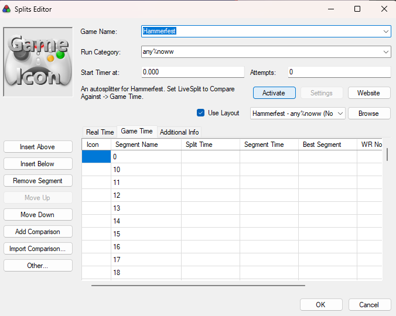

# hammerfest-autosplitter

[](https://github.com/cmnemoi/hammerfest-autosplitter/actions/workflows/continuous-integration.yml)
[](https://github.com/cmnemoi/hammerfest-autosplitter/actions/workflows/continuous-delivery.yml)
[](https://codecov.io/gh/cmnemoi/hammerfest-autosplitter)

A LiveSplit autosplitter for [Hammerfest / Eternalfest](https://eternalfest.net/). It starts
the timer when level 0 appears, splits on every level crossed, splits once more
at the elevator that ends the run, and resets when the game is over.

## How to use it

The autosplitter is available directly in LiveSplit. You do not need to download a file.

1. **Edit Splits**, and set **Game Name** to `Hammerfest`;
2. click **Activate**;
3. right click -> **Compare Against -> Game Time**.



Do not skip step 3. The big timer shows *real time*, which starts a few
hundred milliseconds late. The *gametime* channel carries the correct time.

Then start a game: in EternalTwin, in Eternalfest Desktop, which plays it in
Adobe's Flash projector or in [Ruffle](https://ruffle.rs), or on
[eternalfest.net](https://eternalfest.net) in Firefox with the
[Ruffle extension](https://addons.mozilla.org/firefox/addon/ruffle_rs/).
Start **one** game, in **one** player: when several run, the autosplitter reads
EternalTwin first, then the Flash projector, then Ruffle, then Firefox, and
says so in its log. The Flash projector is read under Linux only.

The autosplitter has been tested on:

- Windows, Eternaltwin 1.0.0
- macOS ARM, Eternaltwin 0.6.6 (needs [LiveSplit One Druid](https://github.com/AlexKnauth/livesplit-one-druid) to run)
- Linux x64, Eternaltwin 1.0.0 (needs [LiveSplit One Druid](https://github.com/AlexKnauth/livesplit-one-druid) to run)
- Linux x64, Firefox ESR 140 with the Ruffle extension 0.6.0 on eternalfest.net (needs [LiveSplit One Druid](https://github.com/AlexKnauth/livesplit-one-druid) to run)
- Linux x64, [Eternalfest Desktop 0.1.0](https://github.com/cmnemoi/eternalfest-desktop#install) with Ruffle 0.6.0 (needs [LiveSplit One Druid](https://github.com/AlexKnauth/livesplit-one-druid) to run)
- Linux x64, Eternalfest Desktop after 0.3.0 with Adobe's Flash projector 32.0.0.465 (needs [LiveSplit One Druid](https://github.com/AlexKnauth/livesplit-one-druid) to run)

## How to contribute

You need [mise](https://mise.jdx.dev) to interact with this repository.

```sh
mise run build    # Build the autosplitter for Livesplit
mise run test:unit  # Run the fast tests, in about a second
mise run test     # Run every test, the replays of real captures included
mise run check    # Check for code issues
```

On Windows you also need a C++ linker :

```sh
winget install Microsoft.VisualStudio.2022.BuildTools \
  --override "--quiet --add Microsoft.VisualStudio.Workload.VCTools --includeRecommended"
```

[asr-debugger](https://github.com/LiveSplit/asr-debugger) reloads the module by
itself when the file changes. Leave it open, and build again:

```sh
tools/asr-debugger.exe \
  target/wasm32-unknown-unknown/release/hammerfest_autosplitter.wasm
```

Start at [docs/index.md](docs/index.md). It covers what the autosplitter does,
the four jobs it is made of, where each one lives, and what is still open.

## Credits

This autosplitter and retro-engineering code are published under the [Apache 2.0 License](LICENSE).

Some retro-engineering code and artefacts like `vendor/hf.map.json` comes from [Eternalfest](https://gitlab.com/eternalfest),
MIT.
